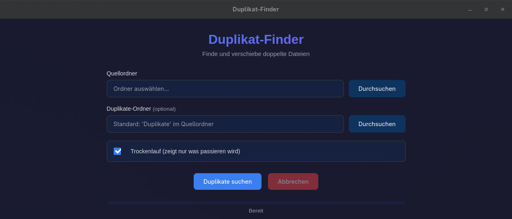
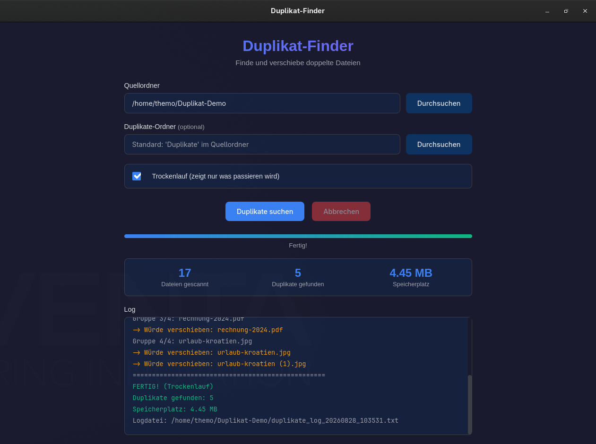

# Duplikat-Finder

Findet doppelte Dateien in einem Ordner und verschiebt sie, statt sie zu löschen. Desktop-App für Windows, Linux und macOS, gebaut mit Tauri und Rust.

[](LICENSE)
[](https://tauri.app)
[](https://www.rust-lang.org)

<p align="center">
  
</p>

<p align="center">
  
</p>

<p align="center"><sub>Screenshots aus der laufenden App, Zahlen aus einem echten Trockenlauf über einen Testordner.</sub></p>

## Warum verschieben statt löschen

Werkzeuge, die Duplikate direkt löschen, verlangen Vertrauen im falschen Moment. Diese App verschiebt gefundene Duplikate in einen eigenen Ordner und schreibt jede einzelne Bewegung in eine Logdatei. Du siehst also hinterher genau, was wohin gegangen ist, und kannst alles zurückholen. Erst wenn du zufrieden bist, löschst du den Ordner selbst.

Dazu kommt der Trockenlauf, und der ist **standardmäßig eingeschaltet**. Beim ersten Start passiert nichts, du bekommst nur die Liste dessen, was passieren würde.

## Wie gesucht wird

Prüfsummen über alle Dateien zu rechnen wäre langsam. Die Suche läuft deshalb in zwei Stufen:

1. **Nach Größe gruppieren.** Alle Dateien werden eingelesen und nach ihrer Bytegröße sortiert. Was in seiner Größe einzigartig ist, kann kein Duplikat sein und fällt sofort raus. Leere Dateien werden übersprungen.
2. **MD5 nur für den Rest.** Nur Dateien, die sich eine Größe teilen, werden tatsächlich gehasht, in 8-KB-Blöcken, damit auch große Dateien nicht komplett in den Speicher müssen. Gleiche Prüfsumme bedeutet Duplikat.

Bei einem Ordner mit vielen unterschiedlich großen Dateien spart die erste Stufe den Großteil der Arbeit.

Die zweite Stufe hasht standardmäßig **parallel**, mit so vielen Fäden wie Kerne da sind, höchstens acht. Auf einer SSD ist das deutlich schneller, auf einer klassischen Festplatte macht paralleles Lesen die Sache langsamer — dafür gibt es den Haken **Parallel hashen**, der ausgeschaltet wieder der Reihe nach arbeitet. Die Gruppen werden unabhängig davon in derselben Reihenfolge aufgebaut, zwei Läufe über denselben Ordner ergeben also dasselbe Log.

**Behalten wird die älteste Datei** einer Gruppe, gemessen am Änderungsdatum. Alle jüngeren Kopien wandern in den Duplikate-Ordner, und zwar unter ihrem ursprünglichen Unterordnerpfad. Gibt es dort schon eine Datei desselben Namens, wird `_1`, `_2` und so weiter angehängt, überschrieben wird nichts.

## Bedienung

1. **Quellordner** auswählen, das ist der Ordner, der durchsucht wird, samt aller Unterordner.
2. **Duplikate-Ordner** optional festlegen. Ohne Angabe legt die App einen Ordner `Duplikate` direkt im Quellordner an. Dieser Ordner wird bei der Suche selbst ausgespart, du kannst also mehrfach laufen lassen.
3. **Trockenlauf** eingeschaltet lassen und auf **Duplikate suchen** klicken.
4. Log ansehen. Passt das Ergebnis, den Haken entfernen und erneut suchen, diesmal echt.

Während des Laufs zeigt die App Fortschritt, Anzahl gescannter Dateien, gefundener Duplikate und den betroffenen Speicherplatz. **Abbrechen** stoppt sauber zwischen zwei Dateien — und während einer Kopie über Plattengrenzen auch mittendrin, wobei die angefangene Zieldatei wieder entfernt wird. Bereits verschobene Dateien bleiben verschoben und stehen im Log.

Die Logdatei heißt `duplikate_log_JJJJMMTT_HHMMSS.txt` und landet im Quellordner. Sie enthält pro Gruppe die Prüfsumme, die behaltene Datei und jede verschobene Kopie mit Quell- und Zielpfad.

## Installation

Fertige Pakete liegen unter [Releases](../../releases): Installer und MSI für Windows, `.deb` und AppImage für Linux.

Für macOS gibt es kein fertiges Paket, dort baust du selbst.

## Selbst bauen

Vorausgesetzt sind [Rust](https://rustup.rs) und [Node.js](https://nodejs.org). Unter Linux zusätzlich die Tauri-Systempakete, unter Debian und Ubuntu:

```bash
sudo apt install libwebkit2gtk-4.1-dev libappindicator3-dev librsvg2-dev patchelf
```

Dann:

```bash
git clone https://github.com/Mario-Mohar/Duplikat-Filesorter.git
cd Duplikat-Filesorter
npm install
npm run tauri dev      # Entwicklungsmodus
npm run tauri build    # Pakete nach src-tauri/target/release/bundle/
```

## Grenzen, die du kennen solltest

- **MD5 ist bewusst gewählt**, weil es schnell ist. Für normales Aufräumen reicht das. Wer sich gegen absichtlich konstruierte Kollisionen absichern muss, braucht ein anderes Werkzeug.
- **Der Duplikate-Ordner darf auf einer anderen Platte liegen.** Verschoben wird per `rename`, das ist sofort fertig; nur wenn das Ziel auf einem anderen Dateisystem liegt, wird kopiert und das Original erst nach erfolgreicher Kopie gelöscht. Das Log vermerkt, welcher Weg genommen wurde.
- **Ein Symlink auf einen Ordner, der schon besucht wurde, wird übersprungen** und im Log gemeldet. Dateien hinter einem Symlink werden also einmal gefunden, nicht mehrfach und nicht endlos.
- Die Oberfläche ist auf Deutsch.

## Technik

Rust im Backend, Vanilla HTML, CSS und JavaScript im Frontend, kein Framework und keine Laufzeitabhängigkeiten. Der Fortschritt kommt über Tauri-Events aus Rust in die Oberfläche, das Abbrechen läuft über ein atomares Flag, das die Suchschleife prüft.

## Lizenz

MIT, siehe [LICENSE](LICENSE).

## Mitarbeit

Fehlerberichte, Funktionswünsche und Pull Requests sind willkommen — etwas zu
finden, das nicht stimmt, und es aufzuschreiben ist ein echter Beitrag, und der
nützlichste dazu.

Die Einzelheiten stehen in **[CONTRIBUTING.md](CONTRIBUTING.md)**: was eine
Meldung brauchbar macht, wie eine Korrektur über einen Fork zu dir kommt, und
was nach dem Absenden passiert.
